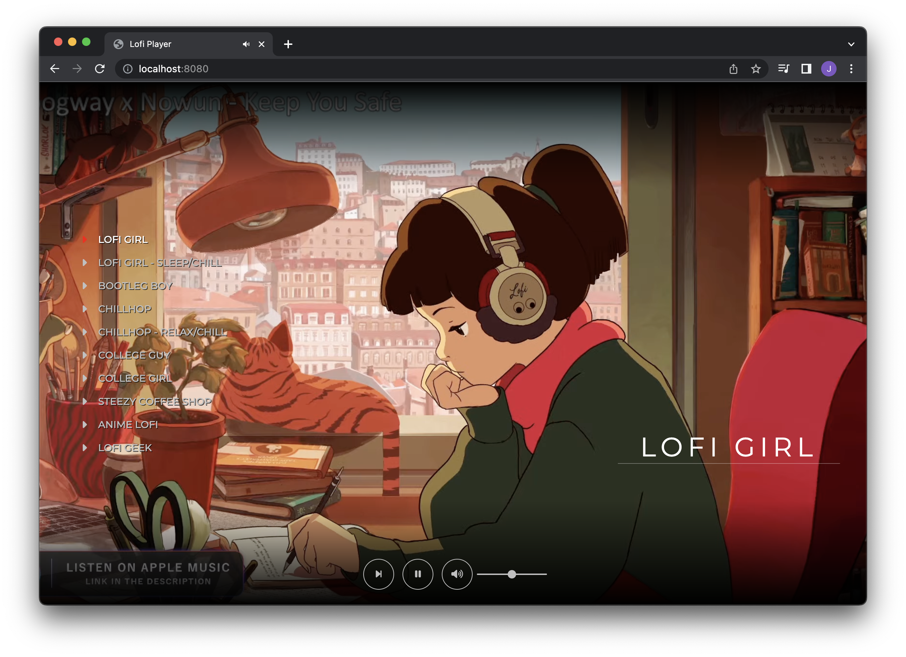

# Lofi-Player

A React app that utilizes react-player to browse and play different Lofi Radio channels hosted on YouTube.

---


App home:

---

## Built With
- [React](https://reactjs.org/) - Front-end
- [Webpack](https://yarnpkg.com/package/webpack)
- [Babel](https://yarnpkg.com/package/@babel/core)
- [gh-pages](https://yarnpkg.com/package/gh-pages) - Deployment

---
### Setup
Install JS packages
```
yarn install
```

### Scripts
To start the local Webpack Dev Server (usually on port `8080`):

```bash
yarn start
```

To lint all JavaScript files in the `src` folder:

```bash
yarn lint
```

To build and deploy your app to `gh-pages` branch on the GitHub repo:

```bash
yarn deploy
```
---

## TODO
[ ] - Change status state implementation from boolean to a string.
[ ] - Redo CSS for the controls
Fix accessibility issues
  [ ] - Make the Channel List accessible - (change to native interactable element)
  [ ] - make controls accessible/ tabbable
